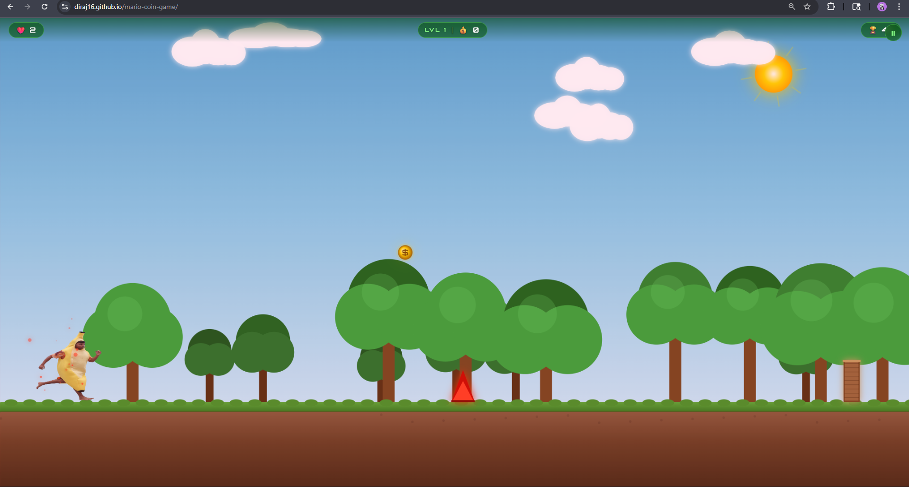

# 🏃 Charan The Runner

> *A hilarious rage-runner game featuring my friend Charan — dodge traps, collect coins, and survive as long as you can!*

---

## 🎮 Play the Game

👉 **[Play Now](https://diraj16.github.io/mario-coin-game)**

---

## 📸 Preview



---

## 🕹️ How to Play

| Action | Keyboard | Mobile |
|--------|----------|--------|
| Jump | `Space` / `↑` Arrow | Tap screen |
| Double Jump | Press twice in air | Tap twice |
| Pause | `P` / `Esc` | ⏸ Button |

- **Collect coins** 💰 to score points
- **Dodge obstacles** — spikes, boulders, falling rocks & walls
- **Combo** coins fast for bonus points
- Every **8 coins** = new level, faster speed!
- You have **3 lives** ❤️❤️❤️ — use them wisely

---

## ✨ Features

- 🖼️ **Real photo** of Charan as the playable character
- 😂 **Friend's voice** plays on Game Over
- 🌳 **Beautiful nature background** — blue sky, sun, clouds, scrolling trees & grass
- ⚡ **Double jump** mechanic
- 🔺 Multiple obstacle types:
  - Ground spikes
  - Ceiling stalactites
  - Falling boulders (with ⚠️ warning!)
  - Wooden log walls
- 💥 **Particle effects** on every hit and coin collect
- 📳 **Screen shake** when you take damage
- 🏆 **High score** saved locally
- 🎉 **New Record** celebration screen
- ✦ **Combo system** with bonus points
- 📱 Fully **mobile responsive**
- ⏸ **Pause** anytime

---

## 🗂️ Project Structure

```
charan-the-runner/
│
├── index.html          # Game layout & screens
├── style.css           # UI styling (HUD, menus, animations)
├── script.js           # Full game engine (canvas, physics, logic)
│
└── assets/
    ├── player.png      # Charan's photo (the main character 😄)
    └── gameover.mp3    # Friend's voice on game over 💀
```

---

## 🛠️ Built With

- **HTML5 Canvas** — fully drawn game world, no game engine
- **Vanilla JavaScript** — pure JS, zero dependencies
- **Web Audio API** — procedural sound effects
- **CSS3** — animated UI, transitions, Google Fonts

---

## 🚀 Run Locally

```bash
# Clone the repo
git clone https://github.com/diraj16/mario-coin-game.git

# Open in browser (use Live Server for best results)
cd mario-coin-game
```

> ⚠️ Open with **VS Code Live Server** or any local server.  
> Direct file:// opening may block audio/images in some browsers.

---

## 🎯 Game Mechanics

### Physics
- Gravity-based jump with tuned feel per device
- Double jump resets on landing
- Speed increases every level (capped at max)

### Obstacle Types
| Obstacle | When | Danger |
|----------|------|--------|
| 🔺 Ground Spike | Level 1+ | Instant hit if you run into it |
| 💜 Ceiling Spike | Level 2+ | Duck... wait you can't 😂 just jump over! |
| 🪨 Falling Boulder | Level 3+ | Drops when you get close — watch for ⚠️ |
| 🪵 Log Wall | Any | Jump over it |

### Scoring
- +1 per coin collected
- Combo x3+ gives bonus points
- High score saved to `localStorage`

---

## 👨‍💻 Developer

Made with 💚 by a friend who thought it would be funny to make Charan run for his life.

---

## 📄 License

This project is for fun and personal use only.  
Charan's face is used with (hopefully) his permission 😂

---

*If you enjoyed the game, give it a ⭐ on GitHub!*
